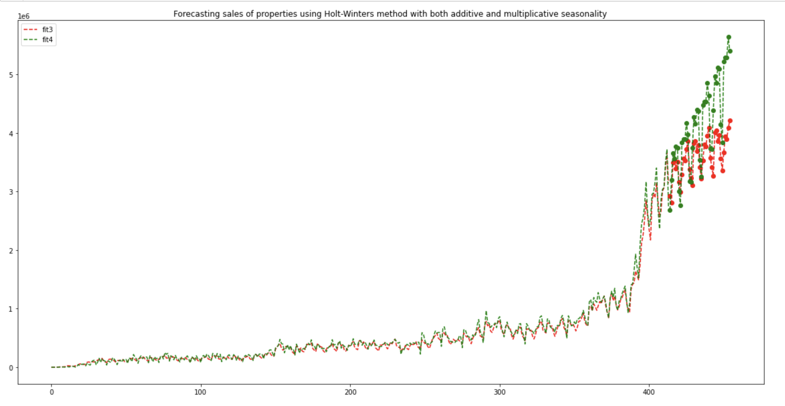
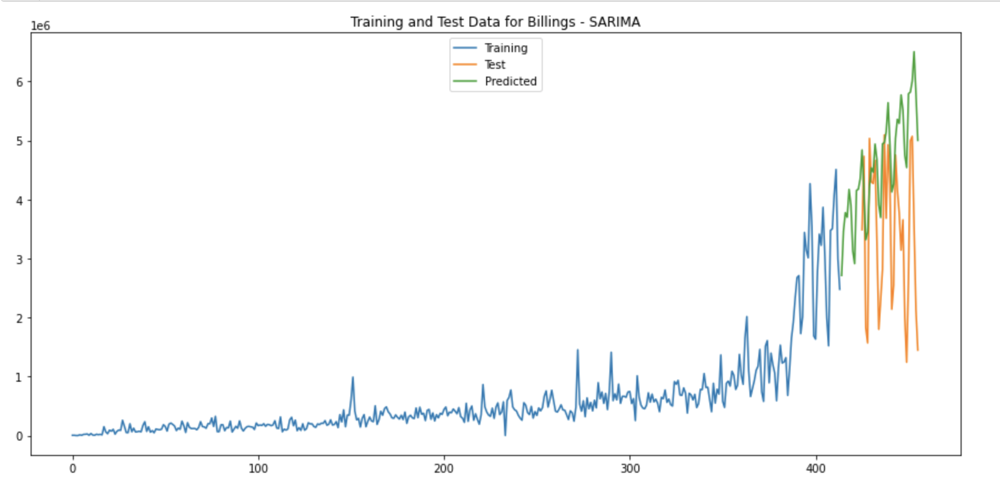
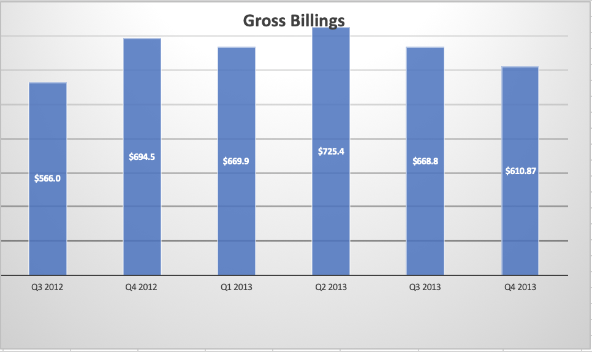
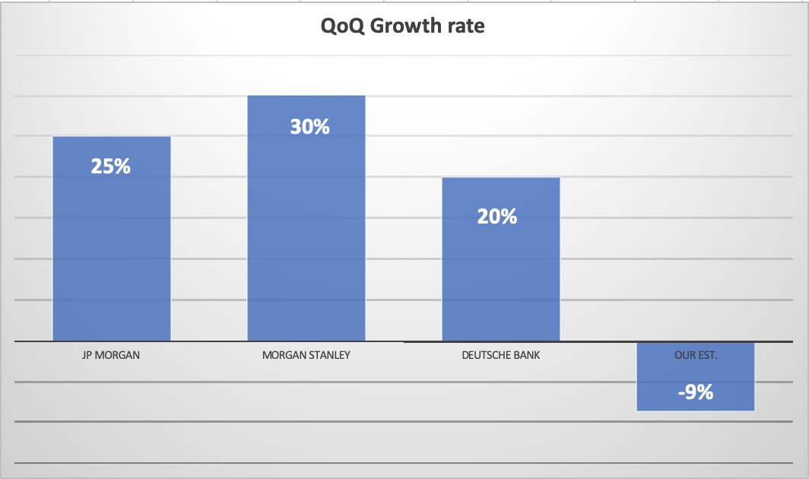
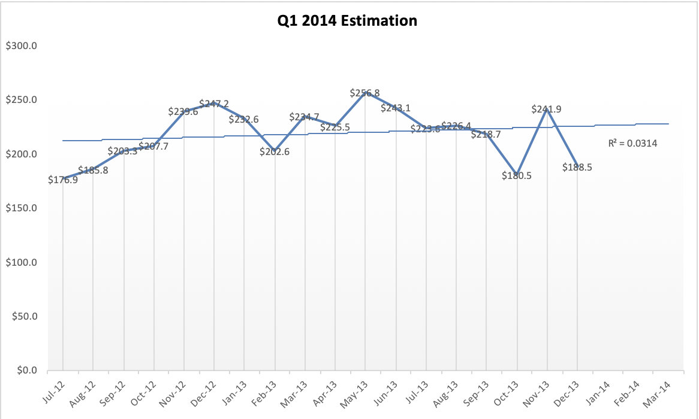

# Financial Reporting
A detailed report to clearly show the financial analysis and business operation of XYZ Capital and to forecast their gross billings in the Quarter 4 of 2013. 
 
## Introduction: 
This project focuses on forecasting financial and economic time series. Stock market prices are highly unpredictable and volatile. However, I decided to not go all the way believing that there is no hope for a machine learning model to train the time-series data. Considering the seasonal nature of the data, I could at least model the data, so that the predictions that I made correlate with the actual behavior of the data.
For making predictions I used the following methods to draw conclusions: 

### 1. Summary Data Analysis

### 2. Development Trend Analysis
 
 Machine learning models on time-series forecasting that I used:
  
  • Holt-Winters Model
  • SARIMA Model 
  
<h3 align="left">
  
   
  <em>Estimated trend using Holt-Winters model </em>
</h3>

<h3 align="left">
  
  
  <em>Estimated trend using SARIMA model </em>
</h3>

### 3. Data Comparison Analysis

<h3 align="left">
  
  
  <em> A solid comparison of all gross billings data </em>
</h3>

### 4. Progress Analysis

The Quarter on Quarter (QoQ) Analysis technique for gross billingsis the main method used to draw conclusions over stock recommendation.
QoQ was be calculated by: 
QoQ % = $ \frac{ Gross Billings(Q4_{2013} - Q4_{2012})}  { Q4_{2012})}$ x 100

<h3 align="left">
  
  
  <em> QoQ growth rate plot </em>
</h3>
 
### 5. Final Remarks
 We will make an estimation for Q1 2014 as well using a Simple Exponential Model (using Excel).
     The R-squared value verifies the accuracy of this model. 
     
<h3 align="center">
  
</h3>     
     
      
     From XYZ Capital's 2012 annual report, we inferred some characteristics from their business and risk factors:
     
     1) Their financial results will be adversely affected if they are unable to execute on their marketing
     strategy.
     2) If they fail to retain their existing customers or acquire new customers, their revenue and business will
     be harmed.
     2) They may incur losses in the future as they expand their business.
     
     This might give valid reasons for an overall negative growth rate in Q4 2013 Gross billings.
     
     The growth rate from our Q4 2013 Estimation may be bad but when we look beyond the earnings, we will see that
     the new deals that were estimated continue to grow in almost all the months after October 2013. 
     Thus, with XYZ Capital's business fundamentals remaining solid, we expect their stock to rebound soon as the
     company adjusts to perform better in the next quarter as observed from the Q4 2014 estimation. 
  
### Conclusion : Our recommendation is to  **Buy** XYZ's stock. 

